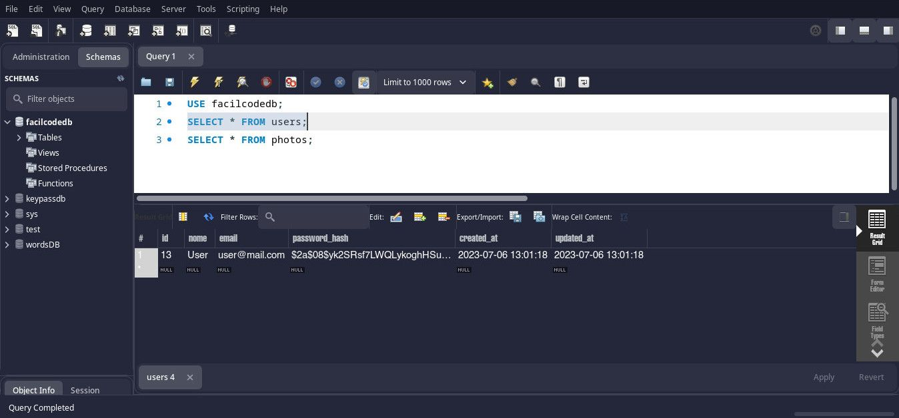

<h2>Gerar QR Code</h2>
<h3>Funcionalidade<h3>

Gerar código qr a partir de chave pix, texto ou link, podendo escolher as cores e o tamanho em pix

<h3>Possibilidade</h3>

Criar uma conta, armazenar imagens de código qr

 

 

 

 

 

 

 

 

 

